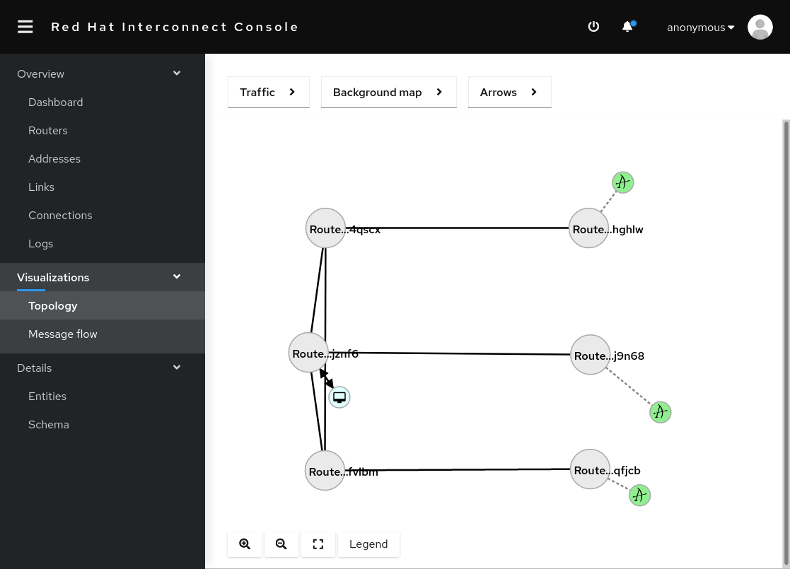

# AMQ Interconnect multi-zone demo on OpenShift

Setting up:

- 3 externally-facing AMQ Interconnect routers, 1 per "zone"

- 3 interior routers, 1 per "zone"

- 3 AMQ brokers which share the same configuration, but separate storage

## How to deploy

This setup rather crudely demonstrates deploying brokers and routers into different "zones", by using the hostname of a _Node_ as a zone.

It sets Pod affinity by looking for _Nodes_ which have specific hostname values in the standard Kubernetes `kubernetes.io/hostname` label.

This means you should get the hostnames of the _Nodes_ in your cluster to use as values for the node selector. OR, you can use another label on your _Nodes_, if you've labelled them in a specific way to show which zone or region they're located in.

To deploy this demo, apply all of the provided YAMLs into a namespace, e.g. `oc apply -f ...`

```
NODE_SELECTOR_KEY=kubernetes.io/hostname
NODE_SELECTOR_VALUE_ZONE1=${NODE_SELECTOR_VALUE_ZONE1}
NODE_SELECTOR_VALUE_ZONE2=${NODE_SELECTOR_VALUE_ZONE2}
NODE_SELECTOR_VALUE_ZONE3=${NODE_SELECTOR_VALUE_ZONE3}

oc apply -f broker-shared-secrets.yml

oc apply -f router-shared-config.yml

oc apply -f router-shared-secrets.yml

oc process -f broker-template.yml -p ZONE_NAME=aztec -p NODE_SELECTOR_KEY=${NODE_SELECTOR_KEY} -p NODE_SELECTOR_VALUE=${NODE_SELECTOR_VALUE_ZONE1} | oc apply -f -

oc process -f broker-template.yml -p ZONE_NAME=medieval -p NODE_SELECTOR_KEY=${NODE_SELECTOR_KEY} -p NODE_SELECTOR_VALUE=${NODE_SELECTOR_VALUE_ZONE2} | oc apply -f -

oc process -f broker-template.yml -p ZONE_NAME=industrial -p NODE_SELECTOR_KEY=${NODE_SELECTOR_KEY} -p NODE_SELECTOR_VALUE=${NODE_SELECTOR_VALUE_ZONE3} | oc apply -f -

oc process -f intra-router-template.yml -p ZONE_NAME=aztec -p NODE_SELECTOR_KEY=${NODE_SELECTOR_KEY} -p NODE_SELECTOR_VALUE=${NODE_SELECTOR_VALUE_ZONE1} | oc apply -f -

oc process -f intra-router-template.yml -p ZONE_NAME=medieval -p NODE_SELECTOR_KEY=${NODE_SELECTOR_KEY} -p NODE_SELECTOR_VALUE=${NODE_SELECTOR_VALUE_ZONE2} | oc apply -f -

oc process -f intra-router-template.yml -p ZONE_NAME=industrial -p NODE_SELECTOR_KEY=${NODE_SELECTOR_KEY} -p NODE_SELECTOR_VALUE=${NODE_SELECTOR_VALUE_ZONE3} | oc apply -f -

oc process -f inter-router-template.yml -p ZONE_NAME=aztec -p NODE_SELECTOR_KEY=${NODE_SELECTOR_KEY} -p NODE_SELECTOR_VALUE=${NODE_SELECTOR_VALUE_ZONE1} | oc apply -f -

oc process -f inter-router-template.yml -p ZONE_NAME=medieval -p NODE_SELECTOR_KEY=${NODE_SELECTOR_KEY} -p NODE_SELECTOR_VALUE=${NODE_SELECTOR_VALUE_ZONE2} | oc apply -f -

oc process -f inter-router-template.yml -p ZONE_NAME=industrial -p NODE_SELECTOR_KEY=${NODE_SELECTOR_KEY} -p NODE_SELECTOR_VALUE=${NODE_SELECTOR_VALUE_ZONE3} | oc apply -f -
```

You should get a nice console like this:


